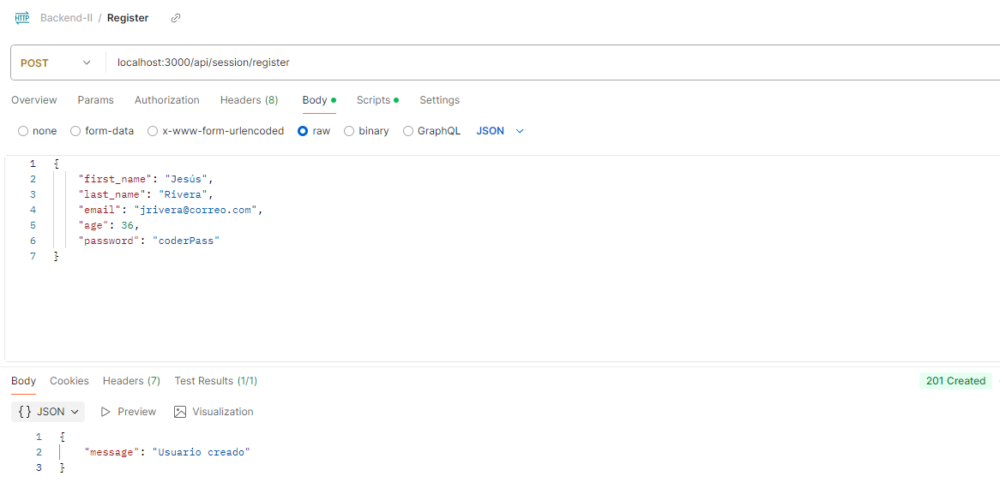
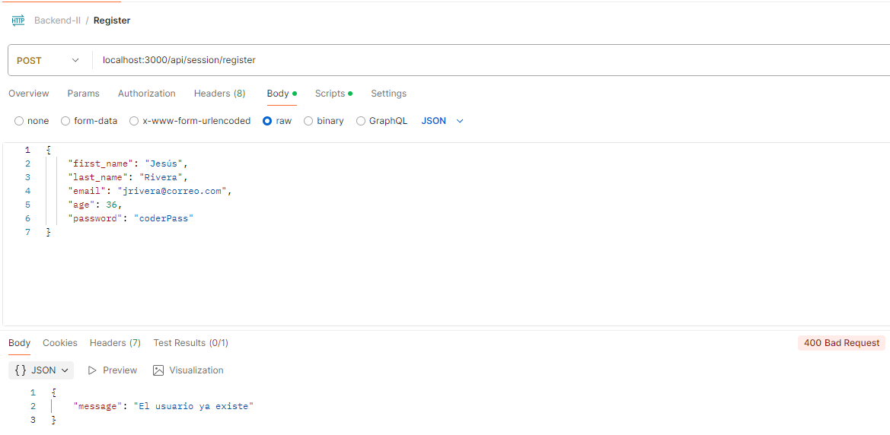
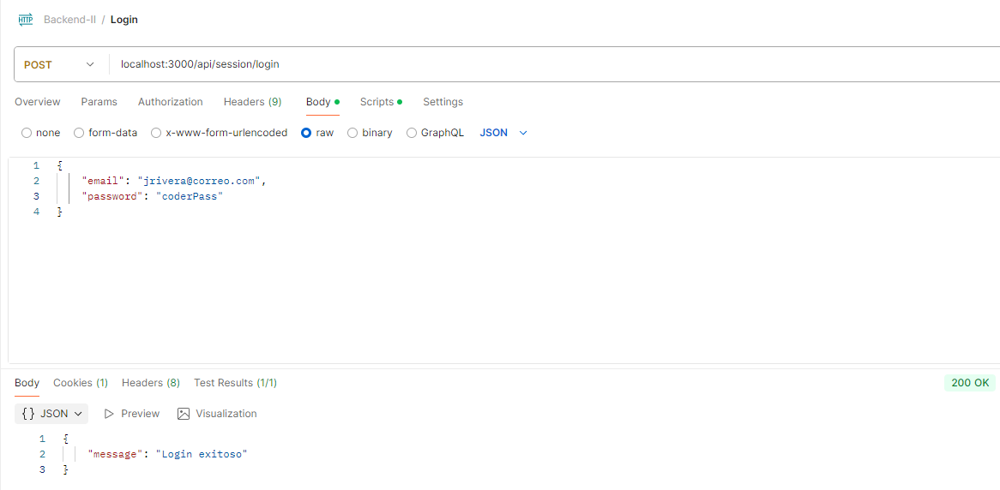
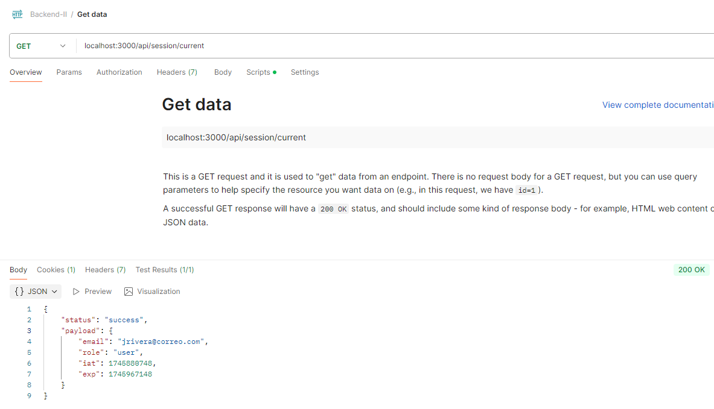
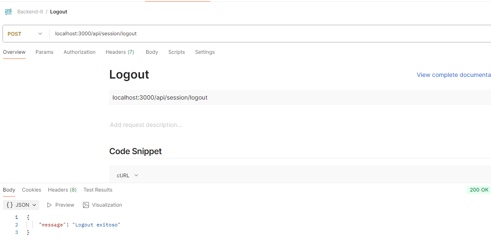

# Backend II: Diseño y Arquitectura - Coderhouse

### Entrega parcial
Este es el primer avance del proyecto para el curso de backend II. Cuenta con un modelo de usuario con persistencia en base de datos MongoDB. Para el manejo de la contraseña se usa el módulo 'bcrypt' con su método 'hashSync'
___

### Prueba de Endpoint

Wireframe del Login

Wireframe del Home

Wireframe del detalle de cada pelicula o serie

Wireframe del detalle de cada pelicula o serie

Wireframe del detalle de cada pelicula o serie

___